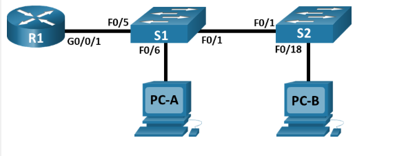
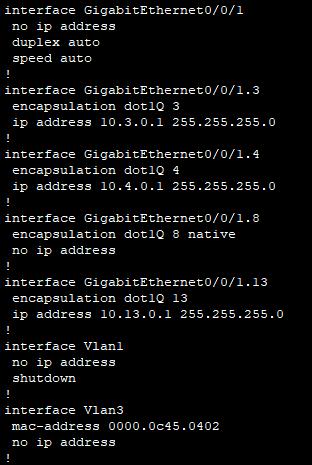
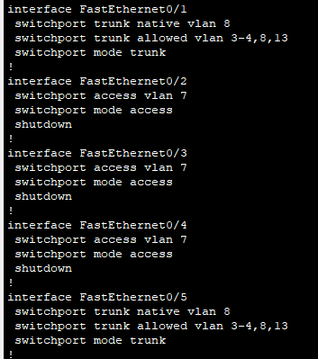
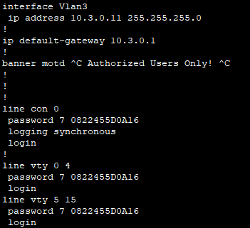
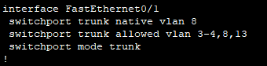
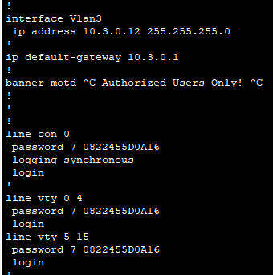

# VLAN Trunking & Inter-VLAN Routing Lab

# Objective
Troubleshoot vlan problems

## Topology

## Configuration and Verification
R1 fixed config

S1 fixed interface config

S1 vlan 3 config

S2 fixed interface config

S2 vlan 3 config

## What I learned / Issues I ran into
The S1 switch have incorrect vlan that is allowing to, improper trunk and native vlan configuration.
In S2 switch the trunk doesn't allow vlan 13 and 3.
The R1 router incorrect encapsulation for interface g0/0/1.8 where it should be encapsulation dot1Q 8 native.
The packet tracer activity also seems to have a bug where I need to close and save the activity so that I can reach 100%.
