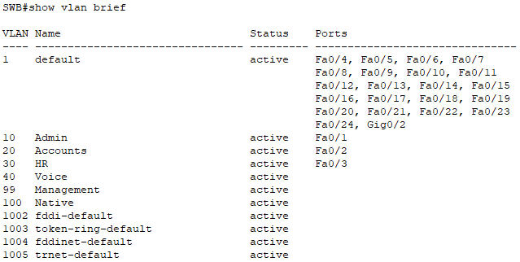
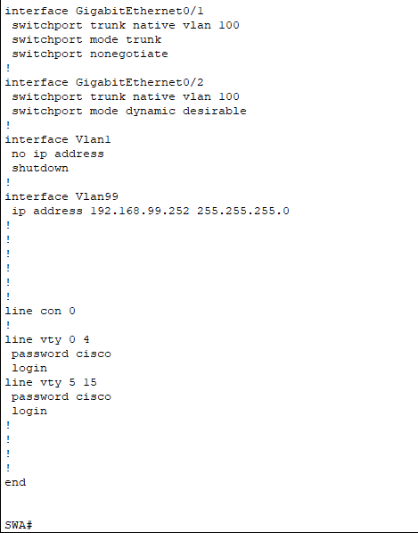
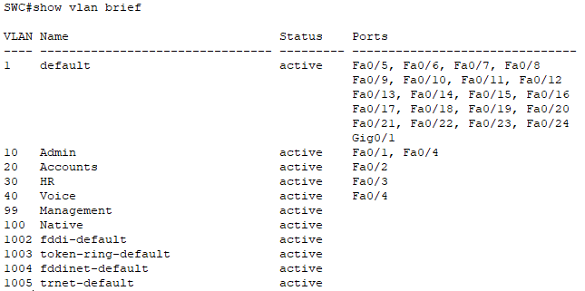

# VLAN Trunking & Inter-VLAN Routing Lab

# Objective
To configure VLANs and assign it to ports and configure static and dynamic trunking.

## Topology

## Configuration

## Verification
SWB#show vlan brief

SWA#show running-config

SWC#show vlan brief

## What I learned / Issues I ran into
